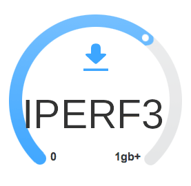

# iperfcon
iperfcon is for Openshift/Kubernetes bandwidth testing the SDN network.
the iperf-client is working with the iperf-server container and outputs 
the iperf3 results summery after we run a GET command  to the iperf-client 
route with the right values.

we can use it for several used cases:

- network bandwidth within the worker
- network bandwidth between 2 workers
- network bandwidth between a Worker and and external Server

## Deploying iperfcon
there are 3 ways to deploy the iperfcon containers 

- Manually
- Ansible
- Operator

### Manually 
The usage of the containers is very simple.

First let's build the namespace for them :

    # oc new-project iperf

Clone the github to your current working directory

    # git clone https://github.com/ooichman/iperfcon.git

Switch to the new namespace (if you haven't already)

    # oc project iperf

Now let's run the deployment for both Deployments

The iperf-server container has 2 environment variables you can run in the deployment:

   - IPERF_PROTOCOL - choose between tcp and udp (default: tcp)
   - IPERF_PORT - choose the port on which the iperf server will listen upon (default: 5001)

    # oc create -f iperfcon/iperf-server/pod-deployment-antiaffinity.yaml

Now deploy the iperf-client 

    # oc create -f iperfcon/iperf-client/pod-deployment-antiaffinity.yaml

Deploy the services

    # oc create -f iperfcon/iperf-client/service.yaml
    # oc create -f iperfcon/iperf-server/service.yaml

And deploy the route 

    # oc create -f iperfcon/iperf-client/route.yaml

For the iperf-check first lets edit the deployment YAML and make sure all the values are in place :

    # vi iperfcon/iperf-check/pod-deployment.yaml

Once we are done with the setting then we can run the deployment :

    # oc create -f iperfcon/iperf-check/pod-deployment.yaml

Now make sure the pods are deployed as you expected:

    # oc get pods -n iperf -o wide

### Ansible

the Ansible deployment is much more easier , all we need to to is run the playbook from a station
connected to the OpenShift/Kuberenetes cluster

First we need to clone the repo 

    # git clone https://github.com/ooichman/iperfcon.git

next we will run the ansible playbook from it's parent directory :

    # cd iperfconf/Ansible
    # ansible-playbook -i inventory main.yaml

Once the playbook is completed make sure the pods are deployed as you expected:

    # oc get pods -n iperf -o wide

### Operator

Will be modified in the near future ...

## How to Use it
now run the curl command to the route to get the results:

    # curl -X GET \
    http://iperf-client-router/iperf/api.cgi?server=iperf-server-service,port=5001,type=log,warnging=5000,critical=3000,format=M

The RESTAPI only expect a GET request with the following values :

- server - the iperf-server service IP address or name
- port - the port you are using on the iperf-server (the default is 5001)
- type - the type of output you want to see , that can be either "html" , "json" or "logs" (lowercap latter ONLY!!)
- format - the output format of bits we would want to see (K,M,G,T,k,m,g,t) 
- warnging - the value on which the query will return warnging in case the output is less then the given value and higher
then the value of "critical"
- critical - the value on which the query will return critical in case the output is less then the given value

if you want to look at the results in a nicer output you can pipe it to jq

    # curl -X GET  \
      http://iperf-client-router/iperf/api.cgi?server=iperf-server-service,port=5001,type=json,format=M,critical=3000,warnging=5000 | \
      jq

